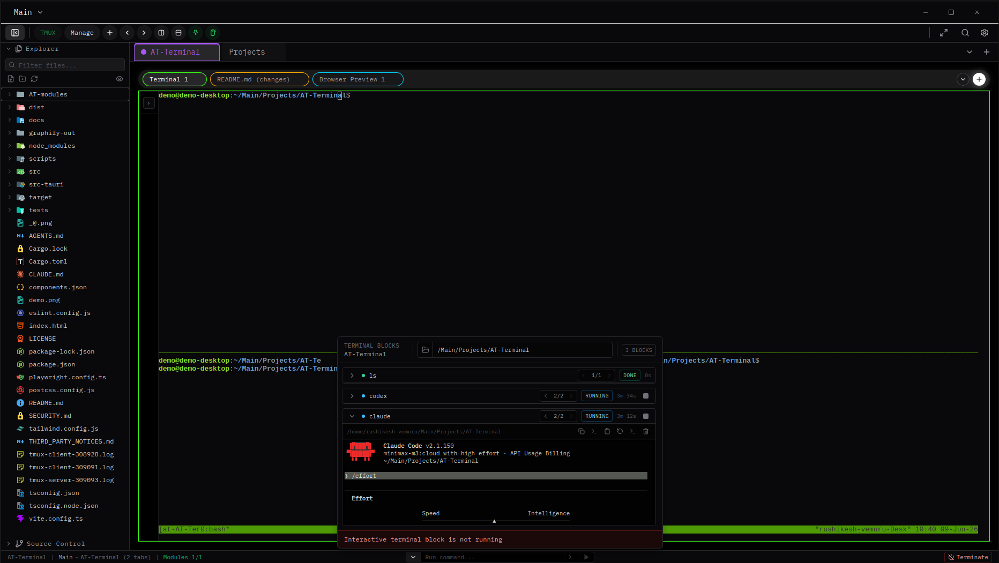

# AT-Terminal

> Local-first desktop terminal and editor workspace. Built on Tauri v2.

<p align="center">
  
</p>

## Features

- PTY-backed terminal (xterm.js) with a tmux session manager
- Monaco editor, file explorer, and git panel (requires github cli)
- Browser preview panel
- Module workspace: native React panels and iframe-backed module panels
- Organise projects in sessions.

## Beta status

**v0.1.0 is a public beta.** Binaries are **not** code-signed or notarized.

- macOS users will see a Gatekeeper warning. Right-click → Open, or `xattr -d com.apple.quarantine /Applications/AT-Terminal.app`.
- Windows users will see a SmartScreen warning. Click "More info" → "Run anyway".
- Linux `.deb`/`.rpm` install without warnings. AppImage may require `--no-sandbox` on systems with strict AppArmor/SELinux policies.

See [Known Beta Limitations](#known-beta-limitations) and [`SECURITY.md`](./SECURITY.md) for the local-first threat model.

## Supported platforms

| Platform | Architecture                               | Installers                    | Signing                |
| -------- | ------------------------------------------ | ----------------------------- | ---------------------- |
| Linux    | x86_64 (Ubuntu 22.04+, Fedora 39+)         | `.deb`, `.rpm`, AppImage      | n/a                    |
| macOS    | aarch64 (Apple Silicon) and x86_64 (Intel) | _Not yet available in v0.1.0_ | n/a                    |
| Windows  | x86_64 (Windows 10 / 11)                   | NSIS `.exe`                   | **Unsigned** in v0.1.0 |

## Downloads

Grab a build from the [GitHub Releases page](https://github.com/rushikeshvemuru/AT-Terminal/releases). Each release includes `SHA256SUMS.txt` alongside the platform-specific bundles.

### Verify a download

Linux / macOS:

```bash
sha256sum -c SHA256SUMS.txt
```

Windows (PowerShell):

```powershell
Get-FileHash -Algorithm SHA256 AT-Terminal_0.1.0_x64-setup.exe
```

## Build from source

### Prerequisites

- **Node.js** 24 or newer (`node --version`).
- **Rust** 1.77 or newer, installed via [`rustup`](https://rustup.rs/) (`rustc --version`).
- **GitHub CLI** (`gh`) 2.0 or newer — required for the git panel and GitHub integration (`gh --version`).
- A Tauri-compatible toolchain for your platform:

**Linux (Debian / Ubuntu):**

```bash
sudo apt update
sudo apt install -y \
  libgtk-3-dev libwebkit2gtk-4.1-dev libayatana-appindicator3-dev \
  librsvg2-dev patchelf rpm tmux
```

**Linux (Fedora):**

```bash
sudo dnf install -y \
  webkit2gtk4.1-devel gtk3-devel libappindicator-gtk3-devel \
  librsvg2-devel rpm-build tmux
```

**macOS:**

```bash
xcode-select --install   # Xcode Command Line Tools
```

**Windows:**

- Install the [Microsoft C++ Build Tools](https://visualstudio.microsoft.com/visual-cpp-build-tools/) (Desktop development with C++ workload).
- WebView2 runtime is bundled with Windows 11. On Windows 10, install the [Evergreen WebView2 Runtime](https://developer.microsoft.com/microsoft-edge/webview2/).

### Clone and run in dev

```bash
git clone https://github.com/rushikeshvemuru/AT-Terminal.git
cd AT-Terminal
npm install
npm run tauri dev
```

`npm install` requires the legacy peer-deps flag because the repo has an ESLint v10 / `eslint-plugin-react` peer dependency mismatch. The repo's `.npmrc` and CI workflows set `npm_config_legacy_peer_deps=true` automatically; if you run `npm install` directly you may need to pass it manually.

### Build a release locally

```bash
npm run tauri build
```

Bundles land in `src-tauri/target/release/bundle/`:

- Linux: `deb/`, `rpm/`, `appimage/`
- Windows: `nsis/`, `msi/`
- macOS: not bundled in v0.1.0 — see [Roadmap](#roadmap).

The base module server binary is built and bundled automatically by `scripts/prepare-tauri-bundle.mjs` (run as the `beforeBuildCommand` in `src-tauri/tauri.conf.json`).

## Architecture and docs

- [`SECURITY.md`](./SECURITY.md) — local-first threat model, supported versions, beta limitations.
- [`AGENTS.md`](./AGENTS.md) — build commands, stack, conventions.
- [`docs/module-authoring-guide.md`](./docs/module-authoring-guide.md) — how to write a module.
- [`docs/panel-toolbar-protocol.md`](./docs/panel-toolbar-protocol.md) — the iframe toolbar `postMessage` contract.

## Troubleshooting

**Stale port 47831** (base module server collides with a previous run):

```bash
# Linux / macOS
lsof -ti:47831 | xargs -r kill -9
```

```powershell
# Windows (PowerShell)
Get-Process -Id (Get-NetTCPConnection -LocalPort 47831).OwningProcess | Stop-Process
```

**`tmux: command not found`** — install tmux (`apt install tmux`, `brew install tmux`, `choco install tmux`).

**`failed to find libwebkit2gtk`** on Linux — install the `libwebkit2gtk-4.1-dev` package listed in the prereqs above.

**macOS Gatekeeper "App is damaged"** — the binary is unsigned in this beta. Strip the quarantine attribute:

```bash
xattr -d com.apple.quarantine /Applications/AT-Terminal.app
```

**Windows SmartScreen** — click "More info" → "Run anyway". For long-term use, code signing is planned for v0.2.0.

**AppArmor / SELinux on Linux** — AppImage may need `--no-sandbox`; `.deb` / `.rpm` install without this.

## Known beta limitations

- v0.1.0 ships the first-party base module only. External modules are not supported in this version.
- Binaries are unsigned / not notarized (see [Beta status](#beta-status)). Code signing is planned for v0.2.0.
- The Playwright E2E suite and a small number of lint warnings are known to be red on the v0.1.0 tag.
- Session files are local application state. Treat untrusted session files as unsafe.
- Terminal panels execute commands as the current operating-system user. Module startup commands are trusted local code.
- Browser preview panels are convenience views, not a hardened web browser.
- `CHANGELOG.md`, `CONTRIBUTING.md`, and `CODE_OF_CONDUCT.md` are not yet in the repo. Planned for v0.2.0.

## Contributing

PRs are welcome. See [`AGENTS.md`](./AGENTS.md) for build commands and conventions, and [`docs/module-authoring-guide.md`](./docs/module-authoring-guide.md) for module authoring. A full `CONTRIBUTING.md` is planned for v0.2.0.

## Roadmap

- Better git panel
- Module support (external / third-party modules)
- Agents
- Settings and customization
- LSP
- Performance optimization and stability

## Community

- **Bug reports and issues:** [github.com/rushikeshvemuru/AT-Terminal/issues](https://github.com/rushikeshvemuru/AT-Terminal/issues)
- **Questions and discussion:** [github.com/rushikeshvemuru/AT-Terminal/discussions](https://github.com/rushikeshvemuru/AT-Terminal/discussions)
- **Security issues:** see [`SECURITY.md`](./SECURITY.md) for the private disclosure channel — please do not file security bugs in public issues.

## License

[Apache-2.0](./LICENSE). Copyright (c) 2026 Rushikesh Vemuru.

See [THIRD_PARTY_NOTICES.md](./THIRD_PARTY_NOTICES.md) for notices covering
vendored and bundled third-party components (xterm.js, material-icon-theme).
